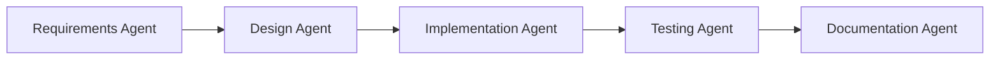

# Multi-Agent AI Workflows Guide

## Table of Contents
- [Understanding Agent Capabilities and Limitations](#understanding-agent-capabilities-and-limitations)
- [Strategies for Dividing Work Between Agents](#strategies-for-dividing-work-between-agents)
- [Communication Patterns Between Agents](#communication-patterns-between-agents)
- [Using Claude Projects for Agent Collaboration](#using-claude-projects-for-agent-collaboration)
- [Concurrent Execution Patterns](#concurrent-execution-patterns)
- [Error Handling and Recovery Strategies](#error-handling-and-recovery-strategies)
- [Real-World Examples of Multi-Agent Workflows](#real-world-examples-of-multi-agent-workflows)

## Understanding Agent Capabilities and Limitations

### Core Capabilities
AI agents excel at:
- **Text Processing**: Analysis, generation, transformation, and summarization
- **Code Operations**: Writing, reviewing, debugging, and refactoring code
- **Data Analysis**: Pattern recognition, data transformation, and insights extraction
- **Task Automation**: Repetitive tasks, workflow orchestration, and process optimization
- **Knowledge Synthesis**: Combining information from multiple sources
- **Creative Problem Solving**: Generating novel solutions and approaches

### Key Limitations
- **Context Window**: Limited memory for long conversations or large codebases
- **Real-time Data**: No access to live internet data or current events
- **State Persistence**: Cannot maintain state between separate sessions
- **External Systems**: Limited to available tools and APIs
- **Concurrent Awareness**: Agents don't have real-time awareness of other agents' actions
- **Resource Constraints**: Processing time and computational limits

### Working Within Constraints
```yaml
# Agent capability matrix
capabilities:
  text_agent:
    strengths: ["documentation", "content creation", "analysis"]
    limitations: ["cannot execute code", "no file system access"]
  
  code_agent:
    strengths: ["code generation", "debugging", "refactoring"]
    limitations: ["cannot test UI", "limited to text-based outputs"]
  
  data_agent:
    strengths: ["data transformation", "analysis", "visualization"]
    limitations: ["memory constraints for large datasets"]
```

## Strategies for Dividing Work Between Agents

### 1. Functional Decomposition
Divide tasks based on specialized functions:

```python
# Example: E-commerce system development
agents = {
    "frontend_agent": {
        "responsibilities": ["UI components", "user interactions", "styling"],
        "technologies": ["React", "CSS", "TypeScript"]
    },
    "backend_agent": {
        "responsibilities": ["API endpoints", "business logic", "database"],
        "technologies": ["Node.js", "PostgreSQL", "REST"]
    },
    "testing_agent": {
        "responsibilities": ["unit tests", "integration tests", "test data"],
        "technologies": ["Jest", "Cypress", "pytest"]
    }
}
```

### 2. Pipeline Processing
Chain agents in sequential workflows:



### 3. Parallel Processing
Distribute independent tasks simultaneously:

```yaml
parallel_tasks:
  - agent: "api_agent"
    task: "Design REST endpoints"
    
  - agent: "database_agent"
    task: "Create schema migrations"
    
  - agent: "frontend_agent"
    task: "Build UI mockups"
```

### 4. Hierarchical Organization
Use coordinator agents to manage specialists:

```python
class WorkflowCoordinator:
    def __init__(self):
        self.specialists = {
            "analysis": AnalysisAgent(),
            "implementation": ImplementationAgent(),
            "review": ReviewAgent()
        }
    
    def execute_task(self, task):
        # Analyze requirements
        requirements = self.specialists["analysis"].analyze(task)
        
        # Implement solution
        solution = self.specialists["implementation"].build(requirements)
        
        # Review and refine
        final = self.specialists["review"].validate(solution)
        
        return final
```

## Communication Patterns Between Agents

### 1. Direct Message Passing
Agents communicate through structured messages:

```json
{
  "from": "backend_agent",
  "to": "frontend_agent",
  "type": "api_update",
  "timestamp": "2024-01-15T10:30:00Z",
  "content": {
    "endpoint": "/api/inventory/sync",
    "method": "POST",
    "request_schema": {
      "shopId": "string",
      "products": "array"
    },
    "response_schema": {
      "success": "boolean",
      "syncedCount": "number"
    }
  }
}
```

### 2. Shared Context Repository
Use a central knowledge base:

```yaml
shared_context:
  project_requirements:
    - "Must support real-time inventory sync"
    - "Handle 10,000+ products"
    
  design_decisions:
    - decision: "Use event-driven architecture"
      rationale: "Better scalability for real-time updates"
      decided_by: "architecture_agent"
      
  api_contracts:
    - endpoint: "/sync"
      owner: "backend_agent"
      consumers: ["frontend_agent", "mobile_agent"]
```

### 3. Event-Driven Communication
Agents react to events:

```python
class EventBus:
    def __init__(self):
        self.subscribers = defaultdict(list)
    
    def subscribe(self, event_type, agent):
        self.subscribers[event_type].append(agent)
    
    def publish(self, event):
        for agent in self.subscribers[event.type]:
            agent.handle_event(event)

# Usage
event_bus = EventBus()
event_bus.subscribe("code_complete", testing_agent)
event_bus.subscribe("tests_passed", deployment_agent)
```

### 4. Request-Response Pattern
Synchronous communication for immediate needs:

```python
class AgentCommunication:
    async def request_service(self, target_agent, request):
        response = await target_agent.process_request({
            "id": generate_id(),
            "timestamp": datetime.now(),
            "sender": self.agent_id,
            "request": request
        })
        return response
```

## Using Claude Projects for Agent Collaboration

### 1. Project Structure for Multi-Agent Work
```
claude-project/
├── agents/
│   ├── frontend-agent/
│   │   ├── context.md
│   │   ├── responsibilities.md
│   │   └── interfaces.md
│   ├── backend-agent/
│   │   ├── context.md
│   │   ├── responsibilities.md
│   │   └── interfaces.md
│   └── shared/
│       ├── project-goals.md
│       ├── api-contracts.md
│       └── design-decisions.md
├── workflows/
│   ├── feature-development.md
│   └── bug-fixing.md
└── handoffs/
    ├── frontend-to-backend.md
    └── backend-to-frontend.md
```

### 2. Knowledge Sharing Strategies
```markdown
# shared/api-contracts.md

## Inventory Sync API

### Endpoint: POST /api/inventory/sync
**Owner**: Backend Agent
**Consumers**: Frontend Agent, Mobile Agent

#### Request
```json
{
  "shopId": "shop_123",
  "products": [
    {
      "sku": "PROD-001",
      "quantity": 100,
      "location": "warehouse-1"
    }
  ]
}
```

#### Response
```json
{
  "success": true,
  "syncedCount": 1,
  "errors": []
}
```

**Last Updated**: 2024-01-15 by Backend Agent
**Change Log**: Added error array for partial failures
```

### 3. Handoff Documentation
```markdown
# handoffs/frontend-to-backend.md

## Frontend to Backend Handoff Protocol

### 1. Feature Request Handoff
When frontend needs new API endpoint:

**Frontend Agent Provides:**
- UI mockups/wireframes
- Required data fields
- Expected user flows
- Performance requirements

**Backend Agent Delivers:**
- API endpoint specification
- Sample requests/responses
- Error scenarios
- Integration timeline

### 2. Bug Report Handoff
**Frontend Agent Provides:**
- Steps to reproduce
- Expected vs actual behavior
- Network logs
- Browser/environment details

**Backend Agent Delivers:**
- Root cause analysis
- Fix implementation
- Testing instructions
- Deployment timeline
```

## Concurrent Execution Patterns

### 1. Fork-Join Pattern
Split work and merge results:

```python
async def fork_join_workflow(task):
    # Fork: Create parallel subtasks
    subtasks = [
        create_database_schema(task),
        generate_api_endpoints(task),
        design_ui_components(task)
    ]
    
    # Execute concurrently
    results = await asyncio.gather(*subtasks)
    
    # Join: Merge results
    integrated_solution = merge_results(results)
    return integrated_solution
```

### 2. Producer-Consumer Pattern
One agent produces work for others:

```python
class WorkQueue:
    def __init__(self):
        self.queue = asyncio.Queue()
        
    async def produce(self, design_agent):
        while True:
            component = await design_agent.create_component()
            await self.queue.put(component)
            
    async def consume(self, implementation_agent):
        while True:
            component = await self.queue.get()
            await implementation_agent.implement(component)
```

### 3. Map-Reduce Pattern
Distribute and aggregate work:

```python
async def map_reduce_analysis(codebase):
    # Map: Distribute analysis across agents
    analysis_tasks = []
    for module in codebase.modules:
        agent = get_available_agent()
        task = agent.analyze_module(module)
        analysis_tasks.append(task)
    
    # Execute all analyses concurrently
    results = await asyncio.gather(*analysis_tasks)
    
    # Reduce: Aggregate findings
    summary = aggregate_analysis_results(results)
    return summary
```

### 4. Pipeline with Buffering
Manage flow between agents:

```python
class BufferedPipeline:
    def __init__(self, stages, buffer_size=10):
        self.stages = stages
        self.buffers = [asyncio.Queue(buffer_size) for _ in range(len(stages)-1)]
        
    async def process(self, input_data):
        # Start all pipeline stages
        tasks = []
        for i, stage in enumerate(self.stages):
            if i == 0:
                task = stage.process(input_data, self.buffers[0])
            elif i == len(self.stages) - 1:
                task = stage.process(self.buffers[i-1], None)
            else:
                task = stage.process(self.buffers[i-1], self.buffers[i])
            tasks.append(task)
        
        await asyncio.gather(*tasks)
```

## Error Handling and Recovery Strategies

### 1. Graceful Degradation
```python
class ResilientAgent:
    async def execute_with_fallback(self, primary_task, fallback_task):
        try:
            result = await primary_task()
            return {"status": "success", "result": result}
        except SpecificError as e:
            # Try fallback approach
            try:
                result = await fallback_task()
                return {"status": "degraded", "result": result}
            except Exception as fallback_error:
                return {"status": "failed", "error": str(fallback_error)}
```

### 2. Retry with Exponential Backoff
```python
async def retry_with_backoff(agent_task, max_retries=3):
    for attempt in range(max_retries):
        try:
            return await agent_task()
        except TemporaryError as e:
            if attempt == max_retries - 1:
                raise
            wait_time = 2 ** attempt  # Exponential backoff
            await asyncio.sleep(wait_time)
```

### 3. Circuit Breaker Pattern
```python
class CircuitBreaker:
    def __init__(self, failure_threshold=5, recovery_timeout=60):
        self.failure_count = 0
        self.failure_threshold = failure_threshold
        self.recovery_timeout = recovery_timeout
        self.last_failure_time = None
        self.state = "closed"  # closed, open, half-open
        
    async def call(self, agent_task):
        if self.state == "open":
            if time.time() - self.last_failure_time > self.recovery_timeout:
                self.state = "half-open"
            else:
                raise CircuitOpenError("Circuit breaker is open")
        
        try:
            result = await agent_task()
            if self.state == "half-open":
                self.state = "closed"
                self.failure_count = 0
            return result
        except Exception as e:
            self.failure_count += 1
            self.last_failure_time = time.time()
            
            if self.failure_count >= self.failure_threshold:
                self.state = "open"
            raise
```

### 4. Checkpoint and Recovery
```python
class CheckpointedWorkflow:
    def __init__(self):
        self.checkpoints = {}
        
    async def execute_with_checkpoints(self, workflow_steps):
        for i, step in enumerate(workflow_steps):
            checkpoint_key = f"step_{i}_{step.name}"
            
            # Check if already completed
            if checkpoint_key in self.checkpoints:
                continue
                
            try:
                result = await step.execute()
                self.checkpoints[checkpoint_key] = result
                self.save_checkpoint()
            except Exception as e:
                # Can resume from last successful checkpoint
                raise WorkflowError(f"Failed at {step.name}", checkpoint_key)
```

### 5. Error Propagation and Handling
```python
class ErrorContext:
    def __init__(self):
        self.errors = []
        
    def add_error(self, agent_id, error, context):
        self.errors.append({
            "agent_id": agent_id,
            "error": str(error),
            "context": context,
            "timestamp": datetime.now()
        })
        
    def get_error_summary(self):
        return {
            "total_errors": len(self.errors),
            "by_agent": self._group_by_agent(),
            "by_type": self._group_by_type()
        }
```

## Real-World Examples of Multi-Agent Workflows

### Example 1: E-Commerce Platform Development

```python
# Workflow: Build complete e-commerce feature
async def ecommerce_feature_workflow():
    # Phase 1: Requirements and Design (Parallel)
    requirements = await requirements_agent.gather_requirements()
    ui_design = await design_agent.create_mockups()
    api_spec = await architect_agent.design_api()
    
    # Phase 2: Implementation (Parallel with dependencies)
    backend_task = backend_agent.implement_api(api_spec)
    frontend_task = frontend_agent.build_ui(ui_design, api_spec)
    
    backend_result, frontend_result = await asyncio.gather(
        backend_task, frontend_task
    )
    
    # Phase 3: Integration and Testing (Sequential)
    integration = await integration_agent.connect_systems(
        backend_result, frontend_result
    )
    test_results = await testing_agent.run_full_suite(integration)
    
    # Phase 4: Documentation (Parallel)
    docs_tasks = [
        docs_agent.create_api_docs(backend_result),
        docs_agent.create_user_guide(frontend_result),
        docs_agent.create_dev_guide(integration)
    ]
    await asyncio.gather(*docs_tasks)
    
    return {
        "feature": integration,
        "tests": test_results,
        "documentation": docs_tasks
    }
```

### Example 2: Code Migration Project

```python
class CodeMigrationWorkflow:
    def __init__(self):
        self.agents = {
            "analyzer": CodeAnalysisAgent(),
            "converter": CodeConversionAgent(),
            "validator": ValidationAgent(),
            "documenter": DocumentationAgent()
        }
        
    async def migrate_codebase(self, source_path, target_language):
        # Step 1: Analyze existing codebase
        analysis = await self.agents["analyzer"].analyze_structure(source_path)
        
        # Step 2: Parallel conversion of modules
        conversion_tasks = []
        for module in analysis.modules:
            task = self.convert_module(module, target_language)
            conversion_tasks.append(task)
        
        converted_modules = await asyncio.gather(*conversion_tasks)
        
        # Step 3: Validate converted code
        validation_results = await self.agents["validator"].validate_all(
            converted_modules
        )
        
        # Step 4: Generate migration documentation
        docs = await self.agents["documenter"].create_migration_guide(
            analysis, converted_modules, validation_results
        )
        
        return {
            "converted_modules": converted_modules,
            "validation": validation_results,
            "documentation": docs
        }
        
    async def convert_module(self, module, target_language):
        # Convert with automatic retry on failure
        max_attempts = 3
        for attempt in range(max_attempts):
            try:
                return await self.agents["converter"].convert(
                    module, target_language
                )
            except ConversionError as e:
                if attempt == max_attempts - 1:
                    # Final attempt failed, use fallback
                    return await self.manual_conversion_fallback(module)
                await asyncio.sleep(2 ** attempt)
```

### Example 3: Real-time Data Processing Pipeline

```python
class DataProcessingPipeline:
    def __init__(self):
        self.stages = {
            "ingestion": DataIngestionAgent(),
            "cleaning": DataCleaningAgent(),
            "transformation": DataTransformationAgent(),
            "analysis": DataAnalysisAgent(),
            "visualization": VisualizationAgent()
        }
        
    async def process_stream(self, data_source):
        # Create processing queues
        queues = {
            "raw": asyncio.Queue(maxsize=1000),
            "cleaned": asyncio.Queue(maxsize=1000),
            "transformed": asyncio.Queue(maxsize=1000),
            "analyzed": asyncio.Queue(maxsize=100)
        }
        
        # Start all pipeline stages concurrently
        tasks = [
            self.stages["ingestion"].ingest(data_source, queues["raw"]),
            self.stages["cleaning"].clean(queues["raw"], queues["cleaned"]),
            self.stages["transformation"].transform(
                queues["cleaned"], queues["transformed"]
            ),
            self.stages["analysis"].analyze(
                queues["transformed"], queues["analyzed"]
            ),
            self.stages["visualization"].visualize(queues["analyzed"])
        ]
        
        # Run pipeline with monitoring
        monitor = PipelineMonitor(queues)
        tasks.append(monitor.monitor_health())
        
        await asyncio.gather(*tasks)
```

### Example 4: Automated Testing Framework

```python
class MultiAgentTestingFramework:
    def __init__(self):
        self.agents = {
            "test_generator": TestGenerationAgent(),
            "test_executor": TestExecutionAgent(),
            "coverage_analyzer": CoverageAnalysisAgent(),
            "report_generator": ReportGenerationAgent()
        }
        
    async def comprehensive_testing(self, codebase):
        # Phase 1: Generate tests for all modules (parallel)
        test_tasks = []
        for module in codebase.modules:
            task = self.agents["test_generator"].generate_tests(module)
            test_tasks.append(task)
            
        all_tests = await asyncio.gather(*test_tasks)
        
        # Phase 2: Execute tests with different configurations
        execution_configs = [
            {"env": "development", "parallel": True},
            {"env": "staging", "parallel": True},
            {"env": "production-like", "parallel": False}
        ]
        
        execution_results = []
        for config in execution_configs:
            result = await self.agents["test_executor"].run_tests(
                all_tests, config
            )
            execution_results.append(result)
        
        # Phase 3: Analyze coverage (can run in parallel with report generation)
        coverage_task = self.agents["coverage_analyzer"].analyze(
            codebase, execution_results
        )
        report_task = self.agents["report_generator"].generate_report(
            execution_results
        )
        
        coverage, report = await asyncio.gather(coverage_task, report_task)
        
        return {
            "tests_generated": len(all_tests),
            "execution_results": execution_results,
            "coverage": coverage,
            "report": report
        }
```

### Example 5: Content Generation Pipeline

```python
class ContentGenerationPipeline:
    def __init__(self):
        self.agents = {
            "researcher": ResearchAgent(),
            "writer": WritingAgent(),
            "editor": EditingAgent(),
            "seo": SEOAgent(),
            "publisher": PublishingAgent()
        }
        
    async def create_content_piece(self, topic, target_audience):
        # Research phase
        research_data = await self.agents["researcher"].gather_information(topic)
        
        # Parallel content creation
        content_tasks = [
            self.agents["writer"].create_draft(research_data, target_audience),
            self.agents["seo"].generate_keywords(topic, target_audience)
        ]
        
        draft, keywords = await asyncio.gather(*content_tasks)
        
        # Editing and optimization loop
        max_iterations = 3
        for i in range(max_iterations):
            # Parallel editing and SEO optimization
            edit_task = self.agents["editor"].edit_content(draft)
            seo_task = self.agents["seo"].optimize_content(draft, keywords)
            
            edited_content, seo_suggestions = await asyncio.gather(
                edit_task, seo_task
            )
            
            # Merge improvements
            draft = self.merge_improvements(edited_content, seo_suggestions)
            
            # Check if quality threshold is met
            if await self.quality_check(draft):
                break
        
        # Publish across platforms
        publishing_result = await self.agents["publisher"].publish_multi_platform(
            draft
        )
        
        return publishing_result
```

## Best Practices Summary

### 1. Design Principles
- **Clear Boundaries**: Define explicit responsibilities for each agent
- **Loose Coupling**: Minimize dependencies between agents
- **Standard Interfaces**: Use consistent communication protocols
- **Idempotency**: Ensure operations can be safely retried

### 2. Performance Optimization
- **Parallel Execution**: Identify independent tasks for concurrent processing
- **Resource Management**: Monitor and limit resource usage per agent
- **Caching**: Share computed results between agents when appropriate
- **Load Balancing**: Distribute work evenly across available agents

### 3. Monitoring and Observability
```python
class AgentMonitor:
    def __init__(self):
        self.metrics = {
            "tasks_completed": Counter(),
            "task_duration": Histogram(),
            "error_rate": Rate(),
            "agent_utilization": Gauge()
        }
        
    def track_agent_performance(self, agent_id, task_result):
        self.metrics["tasks_completed"].increment(agent_id)
        self.metrics["task_duration"].observe(
            agent_id, task_result.duration
        )
        if task_result.error:
            self.metrics["error_rate"].increment(agent_id)
```

### 4. Testing Multi-Agent Systems
- **Unit Testing**: Test each agent in isolation
- **Integration Testing**: Test agent interactions
- **End-to-End Testing**: Validate complete workflows
- **Chaos Testing**: Simulate agent failures and recovery

### 5. Documentation Standards
- **Agent Contracts**: Document inputs, outputs, and behaviors
- **Workflow Diagrams**: Visualize agent interactions
- **Decision Logs**: Record why specific agent architectures were chosen
- **Performance Benchmarks**: Track system performance over time

---

This guide provides a foundation for building robust multi-agent AI systems. As AI capabilities evolve, these patterns and practices will continue to adapt and improve. Remember to always consider the specific requirements of your use case when designing multi-agent workflows.
