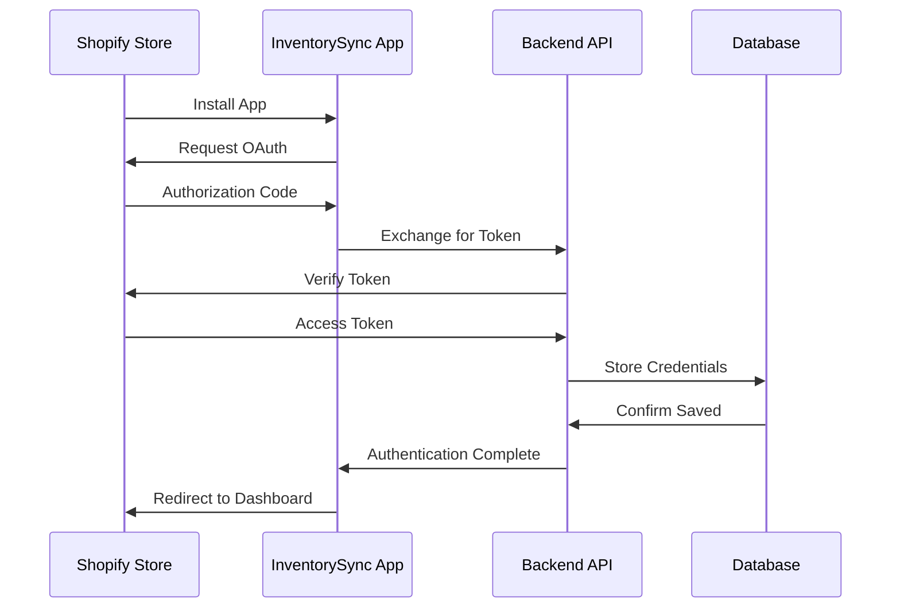

# InventorySync

Advanced Shopify Inventory Management System

<div class="pt-12">
  <span @click="$slidev.nav.next" class="px-2 py-1 rounded cursor-pointer" hover="bg-white bg-opacity-10">
    Press Space for next page <carbon:arrow-right class="inline"/>
  </span>
</div>

<div class="abs-br m-6 flex gap-2">
  <button @click="$slidev.nav.openInEditor()" title="Open in Editor" class="text-xl slidev-icon-btn opacity-50 !border-none !hover:text-white">
    <carbon:edit />
  </button>
  <a href="https://github.com/yourusername/inventorysync-shopify-app" target="_blank" alt="GitHub" title="Open in GitHub"
    class="text-xl slidev-icon-btn opacity-50 !border-none !hover:text-white">
    <carbon-logo-github />
  </a>
</div>

---
transition: fade-out
---

# Table of Contents

<Toc maxDepth="1"></Toc>

---
layout: two-cols
layoutClass: gap-16
---

# Project Overview

<v-clicks>

- 🚀 **Full-stack Shopify Application**
- ⚛️ **React Frontend with Polaris UI**
- 🐍 **FastAPI Backend (Python)**
- 🗄️ **PostgreSQL Database**
- 📦 **Real-time Inventory Sync**
- 🏪 **Multi-location Support**
- 📊 **Advanced Analytics Dashboard**
- 🔔 **Smart Alert System**

</v-clicks>

::right::

# Key Features

<v-clicks>

- 🏷️ **Custom Fields Manager**
- 🔄 **Bulk Operations**
- 📈 **AI-Powered Forecasting**
- 🛡️ **Enterprise Security**
- 🔧 **Workflow Automation**
- 💳 **Shopify Billing Integration**
- 📱 **Responsive Design**
- 🌐 **Multi-language Support**

</v-clicks>

---
class: px-20
---

# Technology Stack

<div class="grid grid-cols-2 gap-12 pt-4">

<div>

### Backend Stack

```python {all|2|3|4|5|6-8|9-11}
# Core Framework
FastAPI==0.104.1
uvicorn[standard]==0.24.0.post1
gunicorn==21.2.0

# Database
SQLAlchemy==2.0.23
asyncpg==0.29.0
alembic==1.12.1

# Authentication & Security
python-jose[cryptography]==3.3.0
passlib[bcrypt]==1.7.4
```

</div>

<div>

### Frontend Stack

```javascript {all|2|3|4|5-7|8-10}
// Core Dependencies
"react": "^18.2.0",
"@shopify/polaris": "^12.0.0",
"@shopify/app-bridge-react": "^3.7.9",

// Routing & State
"react-router-dom": "^6.20.0",
"axios": "^1.6.2",

// Visualization
"chart.js": "^4.4.0",
"recharts": "^2.10.1"
```

</div>

</div>

---
layout: image-right
image: /architecture-diagram.png
---

# Architecture Overview

<v-clicks>

- **Microservices-based architecture**
- **RESTful API design**
- **Event-driven updates via webhooks**
- **Redis for caching & queues**
- **Celery for background tasks**
- **Prometheus & Grafana monitoring**

</v-clicks>

<style>
h1 {
  background-color: #5a67d8;
  background-image: linear-gradient(45deg, #5a67d8 16%, #dc2626 84%);
  background-clip: text;
  -webkit-background-clip: text;
  -webkit-text-fill-color: transparent;
}
</style>

---
layout: center
class: text-center
---

# Core Feature Deep Dive
## Custom Fields Management

<div class="text-6xl text-red-400 animate-pulse">
  <carbon:data-structured />
</div>

<br>

The heart of our inventory management system

---

# Custom Fields - Backend Implementation

```python {all|5-8|15-29|45-57}
from fastapi import APIRouter, HTTPException, Depends
from sqlalchemy.orm import Session
from models import Store, CustomFieldDefinition

class CustomFieldCreate(BaseModel):
    field_name: str
    field_type: str
    display_name: str
    description: Optional[str] = ""
    required: Optional[bool] = False
    default_value: Optional[str] = ""
    validation_rules: Optional[Dict[str, Any]] = {}
    category: Optional[str] = "product"

@router.post("/{shop_domain}")
async def create_custom_field(
    shop_domain: str, 
    field_data: CustomFieldCreate, 
    db: Session = Depends(get_db)
):
    """Create a new custom field using SQLAlchemy"""
    store = get_store(shop_domain, db)
    if not store:
        raise HTTPException(status_code=404, detail="Store not found")
    
    # Validate field name
    if not validate_field_name(field_data.field_name):
        raise HTTPException(status_code=400, detail="Invalid field name format")
    
    # Create custom field definition
    new_field = CustomFieldDefinition(
        store_id=store.id,
        field_name=field_data.field_name,
        display_name=field_data.display_name,
        field_type=field_data.field_type,
        target_entity=field_data.category,
        is_required=field_data.required,
        default_value=field_data.default_value,
        validation_rules=field_data.validation_rules,
        help_text=field_data.description
    )
    
    try:
        db.add(new_field)
        db.commit()
        db.refresh(new_field)
        
        return JSONResponse(
            status_code=201,
            content={
                "status": "success",
                "message": "Custom field created",
                "field_id": new_field.id,
                "field_name": new_field.field_name,
                "field_type": new_field.field_type,
                "display_name": new_field.display_name,
                "is_active": new_field.is_active
            }
        )
    except Exception as e:
        db.rollback()
        raise HTTPException(status_code=500, detail="Internal server error")
```

<style>
.slidev-layout h1 {
  margin-bottom: 1rem;
}
</style>

---

# Custom Fields - Frontend React Component

```jsx {all|8-29|33-38|40-52}
import React, { useState, useEffect } from 'react';
import { Card, Form, TextField, Select, Checkbox, Button } from '@shopify/polaris';

const CustomFieldsManager = ({ shop, showToast }) => {
  const [fieldDefinitions, setFieldDefinitions] = useState({});
  const [loading, setLoading] = useState(true);
  
  const [newField, setNewField] = useState({
    field_name: '',
    display_name: '',
    field_type: 'text',
    target_entity: 'product',
    is_required: false,
    is_searchable: true,
    is_filterable: true,
    help_text: '',
    field_group: 'basic',
    validation_rules: {}
  });

  const entityTypes = [
    { label: 'Products', value: 'product' },
    { label: 'Product Variants', value: 'variant' }, 
    { label: 'Inventory Items', value: 'inventory_item' },
    { label: 'Suppliers', value: 'supplier' },
    { label: 'Locations', value: 'location' }
  ];

  const fieldTypes = [
    { label: 'Text', value: 'text' },
    { label: 'Number', value: 'number' },
    { label: 'Date', value: 'date' },
    { label: 'Yes/No', value: 'boolean' },
    { label: 'Dropdown (Single)', value: 'select' },
    { label: 'Dropdown (Multiple)', value: 'multi_select' },
    { label: 'Email', value: 'email' },
    { label: 'URL', value: 'url' }
  ];

  const handleCreateField = async () => {
    try {
      const response = await fetch(`/api/custom-fields/${shopDomain}`, {
        method: 'POST',
        headers: { 'Content-Type': 'application/json' },
        body: JSON.stringify(newField)
      });

      if (response.ok) {
        showToast('Custom field created successfully!');
        fetchFieldDefinitions();
      }
    } catch (error) {
      showToast('Failed to create field', true);
    }
  };

  return (
    <Card title="Custom Fields Manager">
      {/* Component UI */}
    </Card>
  );
};
```

---
layout: two-cols
---

# Industry Templates

Pre-built field templates for quick setup:

<v-clicks>

### 👔 Apparel
- Size (XS, S, M, L, XL, XXL)
- Color
- Material
- Season

### 📱 Electronics
- Warranty Period
- Technical Specifications
- Compatibility

### 🍔 Food & Beverage
- Expiration Date
- Batch Number
- Storage Temperature
- Ingredients

</v-clicks>

::right::

```json {all|2-9|10-17|18-25}
{
  "apparel": [
    {
      "field_name": "size",
      "field_type": "select",
      "display_name": "Size",
      "options": ["XS", "S", "M", "L", "XL", "XXL"],
      "required": true
    },
    {
      "field_name": "color",
      "field_type": "text",
      "display_name": "Color",
      "required": true
    }
  ],
  "electronics": [
    {
      "field_name": "warranty_period",
      "field_type": "number",
      "display_name": "Warranty Period (months)",
      "required": true
    }
  ]
}
```

---
layout: fact
---

# Performance Optimizations

<div class="text-6xl">
  <carbon:rocket /> + <carbon:chart-line /> = ⚡
</div>

<br>

Bulk operations, caching, and async processing

---

# Database Schema & Optimization

```sql {all|1-11|13-22|24-27}
-- Core tables with optimized indexes
CREATE TABLE custom_field_definitions (
    id BIGSERIAL PRIMARY KEY,
    store_id BIGINT NOT NULL REFERENCES stores(id),
    field_name VARCHAR(100) NOT NULL,
    display_name VARCHAR(255) NOT NULL,
    field_type VARCHAR(50) NOT NULL,
    target_entity VARCHAR(50) DEFAULT 'product',
    is_active BOOLEAN DEFAULT true,
    created_at TIMESTAMP DEFAULT CURRENT_TIMESTAMP
);

-- Indexes for performance
CREATE INDEX idx_custom_fields_store_id ON custom_field_definitions(store_id);
CREATE INDEX idx_custom_fields_target_entity ON custom_field_definitions(target_entity);
CREATE INDEX idx_custom_fields_active ON custom_field_definitions(is_active);

-- JSONB for flexible storage
CREATE TABLE custom_field_values (
    id BIGSERIAL PRIMARY KEY,
    field_id BIGINT REFERENCES custom_field_definitions(id),
    entity_id VARCHAR(255) NOT NULL,
    value JSONB NOT NULL
);

-- GIN index for JSONB queries
CREATE INDEX idx_custom_values_jsonb ON custom_field_values 
USING gin (value);
```

---
layout: image
image: /dashboard-screenshot.png
backgroundSize: contain
---

# Live Dashboard Demo

---

# Authentication Flow



---
layout: two-cols
---

# Webhook Integration

Real-time synchronization with Shopify

```python {all|1-8|10-20}
@router.post("/webhooks/products/update")
async def handle_product_update(
    request: Request,
    db: Session = Depends(get_db)
):
    # Verify webhook
    if not verify_webhook(request):
        raise HTTPException(status_code=401)
    
    payload = await request.json()
    product_id = payload.get("id")
    
    # Update inventory
    await sync_product_inventory(
        product_id, 
        payload, 
        db
    )
    
    return {"status": "success"}
```

::right::

### Supported Webhooks

<v-clicks>

- ✅ `products/create`
- ✅ `products/update`
- ✅ `products/delete`
- ✅ `inventory_levels/update`
- ✅ `inventory_levels/connect`
- ✅ `inventory_levels/disconnect`
- ✅ `orders/create`
- ✅ `orders/fulfilled`
- ✅ `app/uninstalled`

</v-clicks>

---

# Monitoring & Analytics

<div class="grid grid-cols-2 gap-8">

<div>

### Prometheus Metrics

```python
from prometheus_client import Counter, Histogram

# Request metrics
request_count = Counter(
    'app_requests_total',
    'Total requests',
    ['method', 'endpoint', 'status']
)

# Response time
request_duration = Histogram(
    'app_request_duration_seconds',
    'Request duration',
    ['method', 'endpoint']
)
```

</div>

<div>

### Grafana Dashboard

```json
{
  "dashboard": {
    "title": "InventorySync Metrics",
    "panels": [
      {
        "title": "Request Rate",
        "targets": [{
          "expr": "rate(app_requests_total[5m])"
        }]
      },
      {
        "title": "Response Time",
        "targets": [{
          "expr": "app_request_duration_seconds"
        }]
      }
    ]
  }
}
```

</div>

</div>

---
layout: center
class: text-center
---

# Deployment Architecture

<div class="text-6xl mb-4">
  <carbon:cloud /> <carbon:arrow-right /> <carbon:container-services /> <carbon:arrow-right /> <carbon:data-base />
</div>

Production-ready infrastructure

---

# Production Deployment

```yaml {all|1-10|12-23|25-35}
# docker-compose.production.yml
version: '3.8'

services:
  backend:
    image: inventorysync/backend:latest
    environment:
      - DATABASE_URL=${DATABASE_URL}
      - SHOPIFY_API_KEY=${SHOPIFY_API_KEY}
      - JWT_SECRET=${JWT_SECRET}
    deploy:
      replicas: 3
      resources:
        limits:
          cpus: '1'
          memory: 2G
        
  frontend:
    image: inventorysync/frontend:latest
    depends_on:
      - backend
    ports:
      - "80:80"
      - "443:443"
      
  postgres:
    image: postgres:15-alpine
    volumes:
      - postgres_data:/var/lib/postgresql/data
    environment:
      - POSTGRES_DB=inventorysync
      - POSTGRES_USER=inventorysync
      - POSTGRES_PASSWORD=${DB_PASSWORD}
    deploy:
      placement:
        constraints:
          - node.role == manager
```

---
layout: statement
---

# Security Best Practices

🔐 JWT Authentication | 🛡️ CORS Protection | 🔒 HTTPS Only | 📝 Audit Logging

---

# Testing Strategy

<div class="grid grid-cols-2 gap-8">

<div>

### Backend Testing

```python {all|1-10|12-20}
# test_custom_fields.py
import pytest
from fastapi.testclient import TestClient

def test_create_custom_field(client):
    response = client.post(
        "/api/custom-fields/test-shop.myshopify.com",
        json={
            "field_name": "warranty_period",
            "field_type": "number",
            "display_name": "Warranty Period"
        }
    )
    assert response.status_code == 201
    data = response.json()
    assert data["field_name"] == "warranty_period"

def test_field_validation(client):
    response = client.post(
        "/api/custom-fields/test-shop.myshopify.com",
        json={"field_name": "Invalid Name!"}
    )
    assert response.status_code == 400
```

</div>

<div>

### Frontend Testing

```javascript {all|1-8|10-18}
// CustomFieldsManager.test.jsx
import { render, fireEvent } from '@testing-library/react';
import CustomFieldsManager from './CustomFieldsManager';

test('creates new custom field', async () => {
  const { getByText, getByLabelText } = render(
    <CustomFieldsManager shop="test.myshopify.com" />
  );
  
  fireEvent.change(
    getByLabelText('Field Name'), 
    { target: { value: 'warranty_period' }}
  );
  
  fireEvent.click(getByText('Create Field'));
  
  await waitFor(() => {
    expect(getByText('Custom field created')).toBeInTheDocument();
  });
});
```

</div>

</div>

---

# Future Roadmap

<v-clicks>

### Q1 2025
- 🤖 AI-powered inventory recommendations
- 📱 Mobile app for warehouse management
- 🌍 Multi-currency support

### Q2 2025
- 🔗 Third-party integrations (ERP, WMS)
- 📊 Advanced analytics with ML insights
- 🏭 Manufacturing module

### Q3 2025
- 🌐 Global expansion features
- 🤝 B2B wholesale management
- 📦 Drop-shipping automation

</v-clicks>

---
layout: end
class: text-center
---

# Thank You!

<div class="text-2xl mb-8">
Questions?
</div>

<div class="flex justify-center gap-8">
  <a href="https://github.com/yourusername/inventorysync-shopify-app" class="flex items-center gap-2">
    <carbon-logo-github /> GitHub
  </a>
  <a href="https://inventorysync.prestigecorp.au" class="flex items-center gap-2">
    <carbon:application-web /> Live Demo
  </a>
  <a href="mailto:support@inventorysync.com" class="flex items-center gap-2">
    <carbon:email /> Contact
  </a>
</div>

<br>

### Built with ❤️ using FastAPI + React + Shopify

---
layout: center
---

# Bonus: Live Coding Demo

Let's build a custom field type together!

```python
# Live coding session
# We'll implement a barcode field type with validation
```
